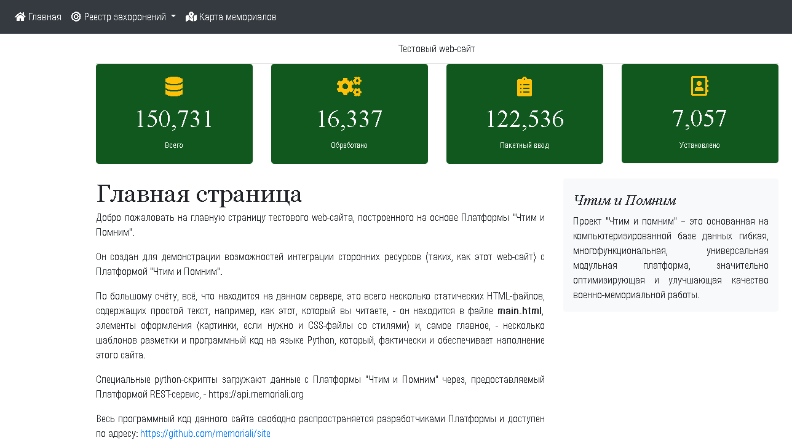
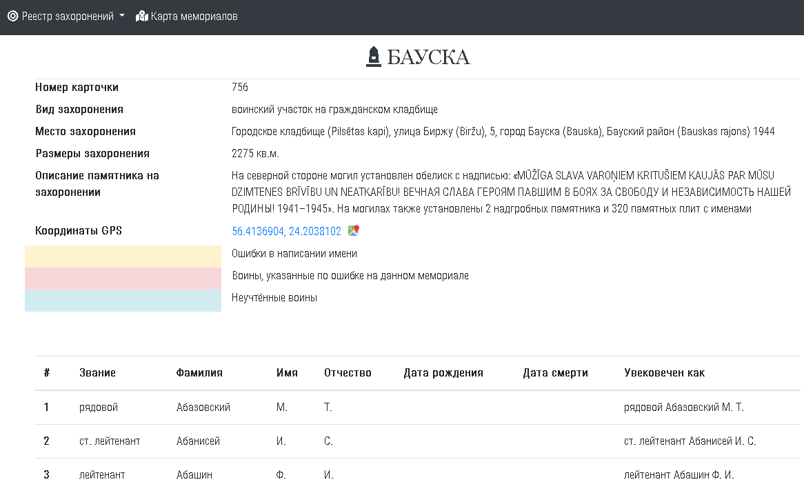
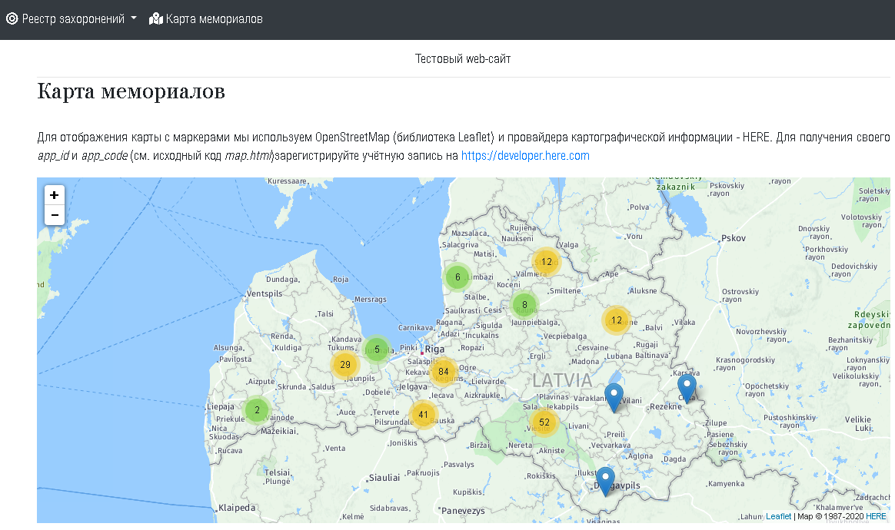

# "Чтим и Помним": образец web-сайта

Перед вами - тестовый web-сайт, построенный на основе Платформы "Чтим и Помним".

Он создан для демонстрации возможностей интеграции сторонних ресурсов (таких, как этот web-сайт) с Платформой "Чтим и Помним".

Этот сайт состоит всего из нескольких статических HTML-файлов, содержащих простой текст, например, как этот, который вы читаете, - он находится в файле <strong>main.html</strong>, элементы оформления (картинки, если нужно, и CSS-файлы со стилями) и, самое главное, - несколько шаблонов разметки и программный код на языке Python, который, фактически и обеспечивает наполнение этого сайта.

Python-скрипты загружают данные с Платформы "Чтим и Помним" через, предоставляемый Платформой REST-сервис, - [https://ciprest.memoriali.org](https://ciprest.memoriali.org)

Для отображения карты с маркерами мы используем OpenStreetMap (библиотека Leaflet) и провайдера картографической информации - HERE. Для получения своего _app_id_ и _app_code_ (см. исходный код _map.html_)зарегистрируйте учётную запись на [https://developer.here.com](https://developer.here.com)

Весь программный код данного сайта свободно распространяется разработчиками Платформы и доступен по адресу: [https://github.com/memoriali/site](https://github.com/memoriali/site)

